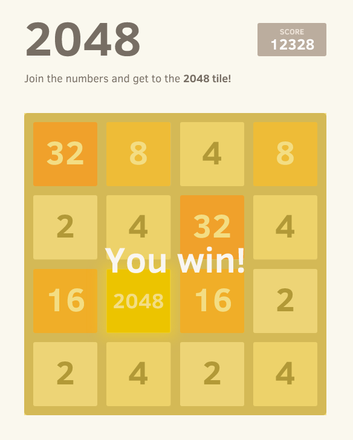

# Dockerized 2048 Game Server

This repository contains Dockerfiles and scripts to set up and run a Dockerized 2048 game server using Nginx. Follow the instructions below to get started.



## Purpose

The purpose of this project is to provide an easy way to run the 2048 game server in a Docker container, allowing you to play the game in a controlled environment.

## Requirements

Before running the project, ensure you have the following prerequisites installed:

- Docker: [Install Docker](https://docs.docker.com/get-docker/)

## Instructions

To set up and run the Dockerized 2048 game server, follow these steps:

1. Clone this repository to your local machine:

   ```bash
   git clone https://github.com/yourusername/2048-game-docker.git
   cd 2048-game-docker
   ```

2. Build the Docker image for the 2048 GameServer using the provided Dockerfile:

   ```bash
   ./scripts/setup.sh
   ```

3. Once the image is built, run the Docker container:

   ```bash
   docker run -d -p 80:80 docker-2048-gameserver-image:latest --name docker-2048-gameserver-container
   ```

   This will start the 2048 game server in a Docker container.

4. Access the game by opening your web browser and navigating to `http://localhost`.

## Clean Resources

To clean up the Docker container and image, you can use the provided script:

```bash
./scripts/clean.sh
```

This will stop and remove the Docker container.

## Resources

- `dockerfiles/2048Game.Dockerfile`: Dockerfile for building the Docker image of the 2048 game server.
- `scripts/setup.sh`: Bash script for building the Docker image and running the container.
- `scripts/clean.sh`: Bash script for stopping and removing the Docker container.

For more information about the 2048 game server, please refer to the official [2048 Game](https://github.com/gabrielecirulli/2048) repository.

